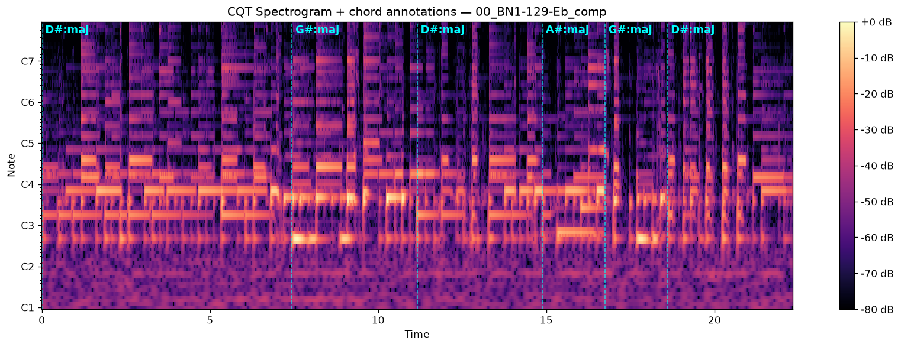
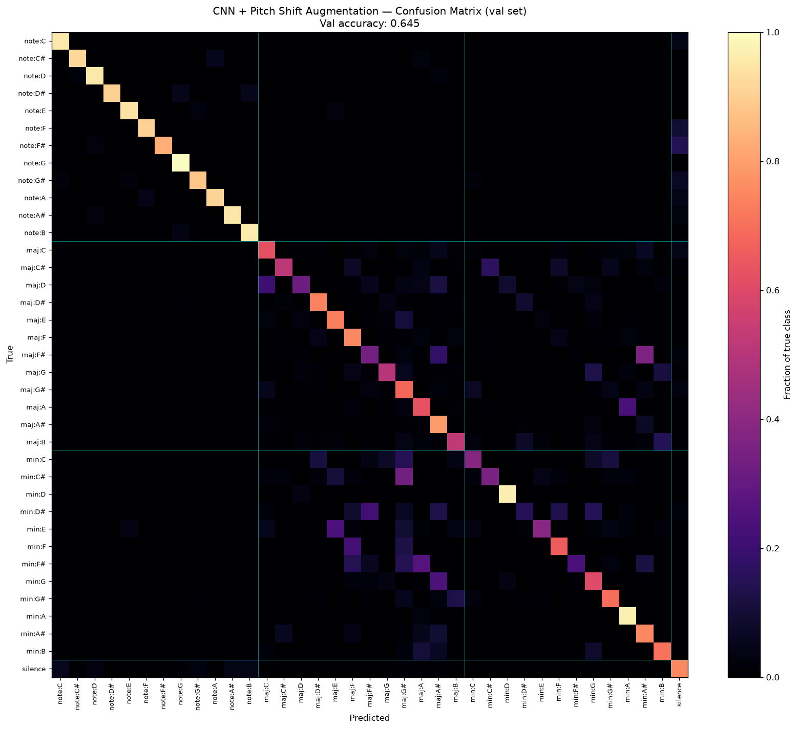
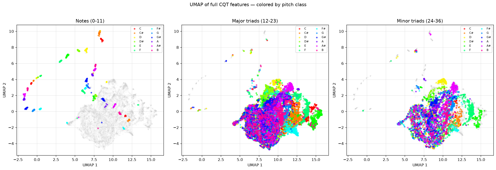
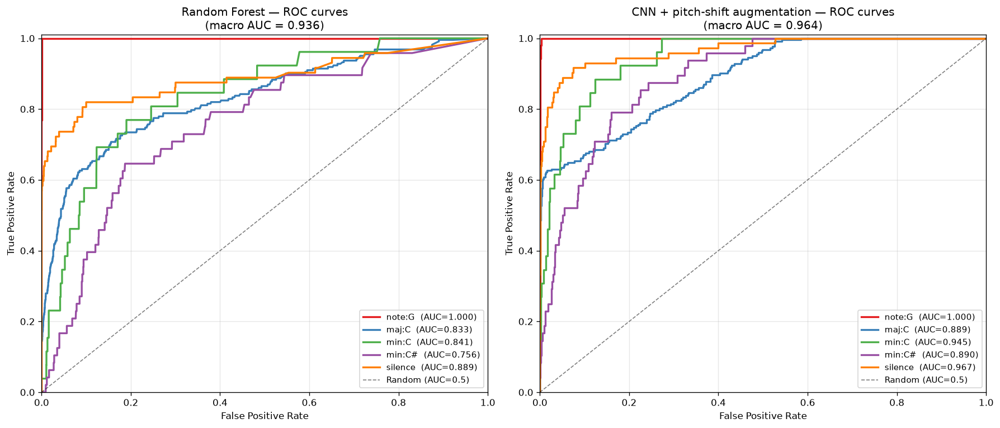

# Guitar Chord & Note Recognition

**Real-time guitar note and chord recognition using deep learning on CQT spectrograms.**

A full ML pipeline — data preparation, EDA, unsupervised analysis, classical baseline, CNN with pitch-shift augmentation, evaluation, and interactive demo — built as the *Stort Individuellt Projekt* for the AI Developer program at Jensen Yrkeshögskola.

---

## What it does

Given a guitar audio signal, the model classifies it into one of **37 classes**:
- 12 single notes (C, C#, D, ..., B)
- 12 major triads
- 12 minor triads
- silence

It works on uploaded audio files **and** on live audio from a USB audio interface (tested with Line 6 Helix LT). A bonus module derives the musical **key** of the piece using Krumhansl-Schmuckler key profiles applied on top of the model outputs.

---

## Results

Trained and evaluated on [GuitarSet](https://guitarset.weebly.com/) with a player-based train/val/test split (no data leakage between splits).

| Metric | Random Forest baseline | CNN + pitch-shift augmentation | Improvement |
|---|---|---|---|
| Test accuracy | 0.541 | **0.633** | **+17%** |
| Test macro F1 | 0.555 | **0.649** | **+17%** |
| Test macro ROC-AUC | 0.918 | **0.946** | +3% |
| Test macro PR-AUC | 0.590 | **0.686** | **+16%** |

The largest per-class gains are on **minor triads** — the exact classes the Random Forest baseline struggled with due to chroma-feature bleed between parallel major/minor pairs.

Selected figures in [`report/`](report/):

| | |
|---|---|
|  |  |
| CQT spectrogram with chord segment overlay — the visual premise of the whole project. | CNN confusion matrix. Clean diagonal, minor triads (bottom right) much improved over RF. |
|  |  |
| Unsupervised UMAP recovers the chromatic scale as a geometric arc — without labels. | ROC curves: CNN closes the gap on the hardest classes (e.g. min:C#). |

---

## Tech stack

- **Python 3.14** on Windows
- **PyTorch** (CPU wheels — Python 3.14 doesn't have TensorFlow support yet)
- **librosa** — audio processing, CQT, chroma, MFCC
- **scikit-learn** — Random Forest baseline, evaluation metrics
- **UMAP** — unsupervised dimensionality reduction
- **Streamlit** — interactive demo app
- **sounddevice** — live audio capture from Helix

Model architecture: 3-block 2D CNN on log-CQT spectrograms (84 pitch bins × 22 time frames), ~98k parameters, trained in ~15 minutes on CPU.

The key trick: **pitch-shift augmentation on CQT arrays** (a `numpy.roll` — essentially free) with automatic label rotation. Multiplies training data 7× and specifically boosts rare classes. Improved val accuracy from 0.601 to 0.645.

---

## Project structure

```
ml-project/
├── notebooks/
│   ├── 01_explore_guitarset.ipynb    # Data exploration, JAMS format
│   ├── 02_prepare_data.ipynb         # Segmentation, labeling, splits
│   ├── 03_features_and_baseline.ipynb # Classical features + Random Forest
│   ├── 04_cnn_train.ipynb            # CNN architecture + training + augmentation
│   ├── 05_unsupervised.ipynb         # PCA, UMAP, K-means analysis
│   └── 06_final_evaluation.ipynb     # ROC-AUC, PR-AUC, comparison
├── app/
│   └── streamlit_app.py              # Interactive demo — file upload + live audio
├── models/
│   └── cnn_augmented_best.pt         # Trained CNN checkpoint (not in git — retrain from notebook 04)
├── report/                           # Generated figures for presentation and reporting
├── data/                             # GuitarSet (not in git — download separately)
└── requirements.txt
```

---

## Running it

```bash
# 1. Clone
git clone https://github.com/AeolianOpus/ml-project.git
cd ml-project

# 2. Create venv (Python 3.10 - 3.14 supported)
python -m venv .venv
.venv\Scripts\Activate.ps1     # PowerShell (Windows)
# source .venv/bin/activate    # macOS/Linux

# 3. Install dependencies (PyTorch CPU + everything else)
pip install -r requirements.txt

# 4. Download GuitarSet from https://zenodo.org/records/3371780
#    Extract into data/guitarset/annotation/ and data/guitarset/audio_mono-mic/

# 5. Run the notebooks in order (01 → 06) to reproduce the full pipeline

# 6. Launch the demo app
streamlit run app/streamlit_app.py
```

The Streamlit app has two modes:
- **Analyze audio file** — upload a WAV/MP3/FLAC/OGG or pick a demo file
- **Live from Helix** — real-time inference from a USB audio interface

---

## Story of the project

The interesting arc lives in the notebooks and the presentation slides. Short version:

1. **Insight**: chords are 2D patterns on CQT spectrograms — a job for a CNN.
2. **Unsupervised finding**: PCA and UMAP on chroma features recover the chromatic scale automatically, without labels — but chord distinctions require deeper representation. Direct motivation for the CNN.
3. **Random Forest baseline** hits 57% val accuracy but systematically confuses parallel major/minor triads (Cmaj vs Cmin share 2 of 3 notes, and chroma features have bin-bleed).
4. **CNN on CQT** closes the major/minor gap but suffers on rare note classes with only ~100 examples each.
5. **Pitch-shift augmentation** turns 13k training examples into 91k, boosting rare classes most — and lifts accuracy across every metric with no trade-offs.
6. **Interactive demo** shows the model working on real audio, with a bonus key-detection module derived from the predictions.

---

## About

Built by [Constantine Diamantis](https://github.com/AeolianOpus) — AI Developer student at Jensen Yrkeshögskola, guitarist, and creator of a companion music theory app in PySide6.
